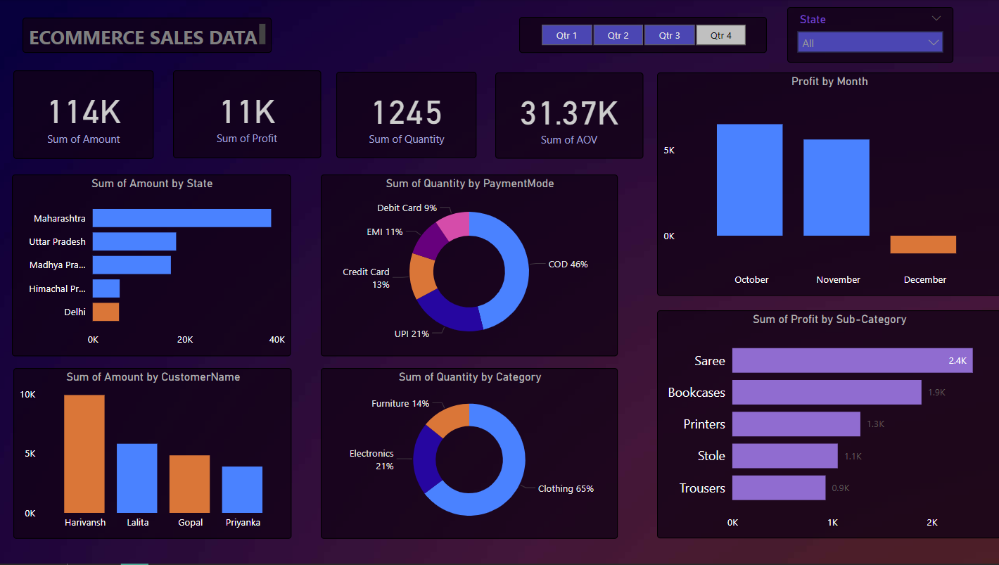

# Power BI Interactive Dashboard Project

## Project Overview

This project demonstrates the creation of an interactive dashboard using **Microsoft Power BI**. The dashboard provides key insights and visualizations for analyzing data effectively, enabling decision-makers to monitor performance metrics, trends, and patterns through intuitive visual reports.

## Features

- **Dynamic Visualizations**: The dashboard includes various visualizations such as bar charts, line graphs, pie charts, and maps to represent data effectively.
- **Filters and Slicers**: Interactive filters allow users to view the data by category, time period, or other criteria, offering a personalized data exploration experience.
- **Drill-Through Reports**: Users can drill through the visualizations to see more detailed information about specific areas of interest.
- **Data Sources**: The dashboard connects to multiple data sources such as Excel, SQL databases, and CSV files, providing a unified view of the data.
- **User-Friendly Interface**: Designed with an intuitive layout for easy navigation and access to key performance indicators (KPIs).

## Technology Stack

- **Power BI Desktop**: Used to create the dashboard and build reports.
- **Data Sources**: Excel, SQL Server, CSV files (mention the exact sources as applicable).
- **DAX (Data Analysis Expressions)**: Used for advanced calculations and creating custom measures.
- **Power Query**: For data cleaning, transformation, and loading into the Power BI model.

## How to Run the Project

1. **Install Power BI Desktop**: Download and install the [Power BI Desktop](https://powerbi.microsoft.com/desktop/) application on your machine.
2. **Open the .pbix file**: Open the `.pbix` file from the `Dashboards` folder in Power BI Desktop.
3. **Load Data**: The data sources should load automatically. If not, navigate to the data source settings and update the data paths.
4. **Interact with the Dashboard**: Use the interactive filters and slicers to explore the data and gain insights.

## Use Cases

- **Sales Performance Tracking**: Monitor sales trends and performance across different regions, products, and time periods.
- **Customer Analysis**: Analyze customer demographics and behavior patterns for more targeted marketing campaigns.
- **Financial Overview**: Track key financial metrics such as revenue, profit, and expenses.

## Future Enhancements

- **Real-time Data Integration**: Integrating real-time data sources to monitor live performance.
- **Advanced Analytics**: Adding machine learning models for predictive analysis.
- **Custom Visuals**: Implementing more advanced and customized visuals using third-party tools.

## Conclusion

This project showcases the power of data visualization with Power BI. The interactive dashboard provides valuable insights that can help businesses and individuals make informed decisions. Future updates to the project may include enhanced analytics and real-time data integration.

## dashboard

